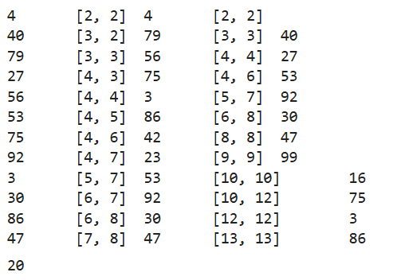

---
## Author
author:
  name: Тазаева Анастасия Анатольевна
  degrees: BSc
  orcid: 
  email: 1032259385@pfur.ru
  affiliation:
    - name: Российский университет дружбы народов
      country: Российская Федерация
      postal-code: 117198
      city: Москва
      address: ул. Миклухо-Маклая, д. 6
## Title
title: "Лабораторная работа №7"
subtitle: "Дискретное логарифмирование в конечном поле"
license: CC BY
date: today
date-format: "2025-11-22" 
---

# Информация

## Докладчик

:::::::::::::: {.columns align=center}
::: {.column width="70%"}

  * Тазаева Анастасия Анатольевна
  * студент группы НФИмд-02-25
  * Российский университет дружбы народов им. П. Лумумбы
  * [1032259385@pfur.ru](mailto:1032259385@pfur.ru)

:::
::: {.column width="30%"}


:::
::::::::::::::

# Введение

## Цель работы

Ознакомиться с pho-методом Полларда для задач дискретного логарифмирования. Реализовать его.

## Задачи

1. Реализовать на языке программирования Julia pho-метод Полларда.

# Теоретические сведения

## Разложение на множители

Алгоритм Полларда — это эффективный метод для нахождения дискретного логарифма, который использует идею случайных блужданий и метод "кролика и черепахи".

Дискретный логарифм — это задача нахождения целого числа x по заданным элементам g и y в конечной группе G, такой что:

$$ g^x \equiv y (mod p)$$

где g — основание, y — результат возведения в степень, а p — простое число, определяющее порядок группы.

# Программный код

## pho-метод Полларда для задач дискретного логарифмирования

```Julia
function pollard_log(p, a, r, u, v, b, f::Function)
        # step 1
        c = mod(a^u * b^v, p) 
        d = c
        
        log_c = [u, v]
        log_d = [u, v]
        println(c, "\t", log_c, "\t", d, "\t", log_d)
        while true
            # step 2 koeff pri log c
            c = mod(f(c),p)
            if c < r
                log_c[1] += 1
            else
                log_c[2] += 1
            end
            
            # step 2 koeff pri log d
            temp_d = f(d)
            if temp_d < r
                log_d[1] += 1
            else
                log_d[2] += 1 
            end
            d = mod(f(temp_d),p)  
            if d < r
                log_d[1] += 1
            else
                log_d[2] += 1 
            end
            println(c, "\t", log_c, "\t", d, "\t", log_d, "\t", temp_d)
            # step 2 sravnenie
            if c == mod(d,p)
                break
            end
        end
        # step 3
        a = log_c[1] - log_d[1]
        b = log_c[2] - log_d[2]
        if b == 0
            error("delenie na 0, net reshenii")
        end
        # x = (-a)*b^(-1) mod r
        x = mod(-a * invmod(b, r), r)
        return x
    end
```

## pho-метод Полларда. Результат работы программного кода

{#fig-001 width=70%}

# Заключение

## Вывод

В ходе лабораторной работы был изучен pho-метод Полларда для задач дискретного логарифмирования.
