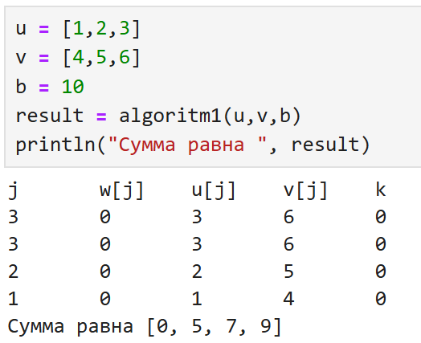
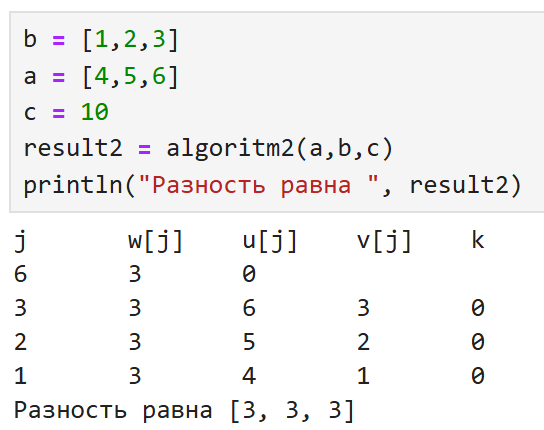
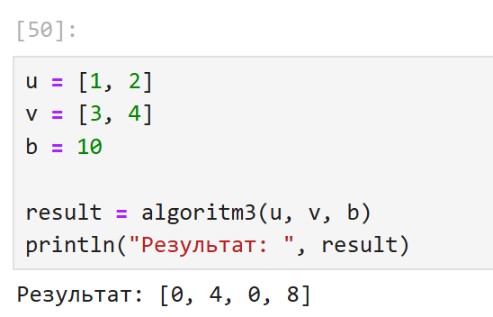
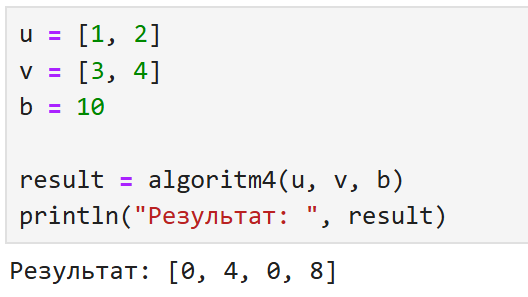

---
## Author
author:
  name: Тазаева Анастасия Анатольевна
  degrees: BSc
  orcid: 
  email: 1032259385@pfur.ru
  affiliation:
    - name: Российский университет дружбы народов
      country: Российская Федерация
      postal-code: 117198
      city: Москва
      address: ул. Миклухо-Маклая, д. 6

## Title
title: "Лабораторная работа №8"
subtitle: "Целочисленная арифметика многократной точности"
license: "CC BY"
---

# Цель работы

Ознакомиться с алгоритмами для выполнения арифметических операций.

# Задание

1. Реализовать на языке программирования Julia алгоритмы для выполнения арифметических операций.

# Выполнение лабораторной работы

## Алгоритм 1 (сложение неотрицательных целых чисел)

Написан программный код на языке `Julia` [@doc-julia], реализующий сложение неотрицательных целых чисел:

```Julia
function algoritm1(u::Vector{Int}, v::Vector{Int}, b::Int)
    n = length(u) 
    w = zeros(Int, n + 1) # + w0
    # step 1
    k = 0 # perenos
    j = n # razryad
    # step 2 & 3
    #println("j", "\t", "w[j]", "\t", "u[j]", "\t", "v[j]", "\t", "k")
    #println(j, "\t", w[j], "\t", u[j], "\t", v[j], "\t", k)
    while j > 0
        # step 2
        w[j+1] = mod(u[j] + v[j] + k, b)
        k = div(u[j] + v[j] + k, b)
        #println(j, "\t", w[j], "\t", u[j], "\t", v[j], "\t", k)
        # step 3
        j -= 1
    end
    w[1] = k
    return w
end
```

Получен следующий результат выполнения программного кода ([рис. @fig-001]).

{#fig-001 width=70%}

## Алгоритм 2 (вычитание неотрицательных целых чисел)

Написан программный код на языке `Julia` [@doc-julia], реализующий вычитание неотрицательных целых чисел:

```Julia
function algoritm2(u::Vector{Int}, v::Vector{Int}, b::Int)
    n = length(u) 
    w = zeros(Int, n)
    # step 1
    k = 0 # zaem
    j = n # razryad
    # step 2 & 3
    println("j", "\t", "w[j]", "\t", "u[j]", "\t", "v[j]", "\t", "k")
    println(j, "\t", w[j], "\t", u[j], "\t", v[j], "\t", k)
    while j > 0
        # step 2
        w[j] = mod(u[j] - v[j] + k, b)
        k = div(u[j] - v[j] + k, b)
        println(j, "\t", w[j], "\t", u[j], "\t", v[j], "\t", k)
        # step 3
        j -= 1
    end
    return w
end
```

Получен следующий результат выполнения программного кода ([рис. @fig-002]).

{#fig-002 width=70%}

## Алгоритм 3 (умножение неотрицательных целых чисел столбиком)

Написан программный код на языке `Julia` [@doc-julia], реализующий умножение неотрицательных целых чисел столбиком:

```Julia
function algoritm3(u::Vector{Int}, v::Vector{Int}, b::Int)
    n = length(u) 
    m = length(v)
    w = zeros(Int, n + m) 
    
    # step 1
    fill!(w[m+1:end], 0)
    j = m
    # step 2-6
    while j > 0
        # step 2: if vj = 0 -> propyskaem razryad
        vj = v[j]
        if vj == 0 
            j -= 1
            continue
        end
        # step 3
        i = n # index razryada 4isla u 
        k = 0 # perenos
        # step 4 - 5
        while i > 0
            t = u[i] * vj + w[i + j] + k 
            w[i + j] = mod(t, b) #res
            k = div(t, b) # new perenos
            i -= 1 # sled.razryad
        end
        if k > 0
            w[j] = k
        end
        j -= 1
    end
    return w
end
```

Получен следующий результат выполнения программного кода ([рис. @fig-003]).

{#fig-003 width=70%}

## Алгоритм 4 (быстрый столбик)

Написан программный код на языке `Julia` [@doc-julia], реализующий умножение быстрым столбиком:

```Julia
function algoritm4(u::Vector{Int}, v::Vector{Int}, b::Int)
    n = length(u)  
    m = length(v)
    w = zeros(Int, m + n) 
    # step 1
    t = 0 
    # step 2
    for s in 0:(m + n - 1)
        # step 3
        for i in 0:s
            if n - i > 0 && m - s + i > 0
                t += u[n - i] * v[m - s + i]
            end
        end
        # step 4
        w[m + n - s] = mod(t, b)
        t = div(t, b)
    end
    return w
end
```

Получен следующий результат выполнения программного кода ([рис. @fig-004]).

{#fig-004 width=70%}

# Выводы

Ознакомилась с алгоритмами для выполнения арифметических операций.

# Список литературы{.unnumbered}

::: {#refs}
:::
